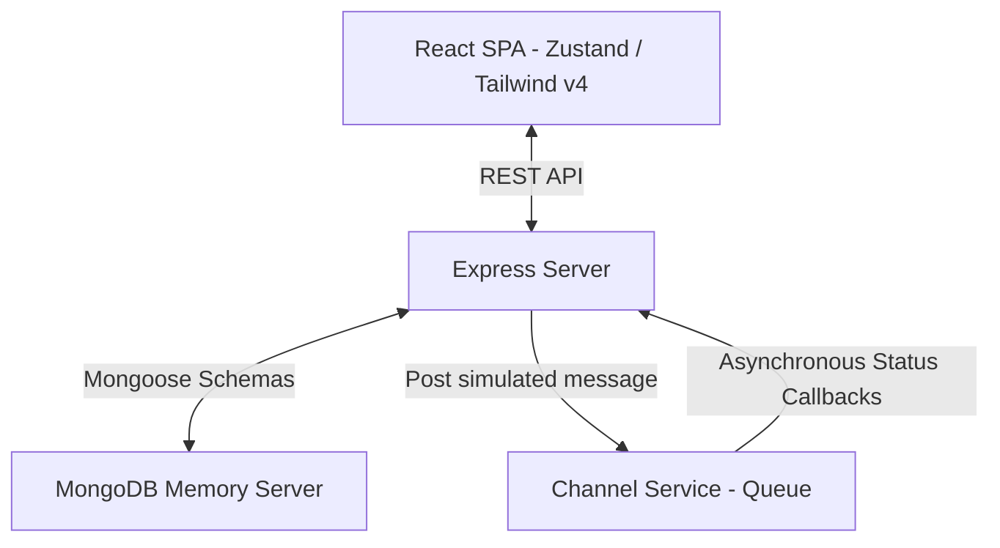

# Xeno Marketing OS — AI-Native D2C Shopper Engagement Platform

A production-grade, enterprise-ready D2C marketing operating system built for Xeno. Marketers can manage shoppers, manually build segments, consult an AI Campaign Strategist, dispatch personalized multichannel campaigns, and monitor conversion metrics via live-updating analytics dashboards.

---

## Technical Stack & Architecture



- **Frontend**: React + Tailwind CSS v4 + Framer Motion (animations) + Recharts (live analytics) + Zustand (state store).
- **Backend**: Express + Mongoose + MongoDB Memory Server (runs a local instance in-memory automatically).
- **Channel Service**: Decoupled Express app simulating message dispatch lifecycles with custom statistics per channel and callback retry queues.

---

## Core Features

### 1. AI Command Center
- ChatGPT-style assistant allowing marketers to type intent (e.g., *"Find fashion shoppers who spent over $100 and write a WhatsApp promo"*).
- Suggests segment filters, selects channels, recommends template copy, and estimates audience sizes dynamically.
- Powered by Gemini SDK with an offline fallback.

### 2. Segment Builder
- Visual query composer evaluating parameters like total spend, inactivity days, category affinity, city, and frequency.
- Live dry-run matched counts.
- AI segment suggestion presets (VIP High-Spenders, Sleeping Shoppers, Beauty Enthusiasts).

### 3. Campaign Control Tower
- Multichannel launcher supporting **WhatsApp**, **SMS**, **Email**, and **RCS**.
- Features interactive device previews showing custom mockup bubbles (WhatsApp chat bubble, RCS card layout, SMS bubble, HTML Email).
- Webhook logging console showing status callbacks streaming in real-time.

### 4. Live Analytics Dashboard
- Animated KPI cards showing influenced revenue, overall CTR, and active shopper index size.
- Attributed sales timeline graphs, delivery lifecycle funnels, and channel mix pie charts.
- Powered by **Recharts** and updated live.

### 5. Shopper DB
- Shopper profile index displaying computed metrics.
- Modal detailing demographics, lifetime values, engagement dials, activity timeline, and AI insights.

---

## Workspace Folder Structure

```
xeno-mini-crm/
├── package.json                   # Root orchestrator
├── crm-backend/                   # Express, Mongoose, and AI strategizing
│   ├── package.json
│   └── src/
│       ├── config/
│       │   └── db.js              # MongoDB / Memory Server connection
│       ├── models/
│       │   ├── Customer.js        # Shopper demographics, LTV, engagement metrics
│       │   ├── Order.js           # Attributed purchase history
│       │   ├── Campaign.js        # Campaign summaries, metrics, and schedules
│       │   └── Communication.js   # Single message log
│       ├── controllers/           # Controllers mapping routes to database
│       │   ├── customerController.js
│       │   ├── campaignController.js
│       │   └── aiController.js
│       ├── services/
│       │   ├── aiService.js       # Gemini API client & offline NLP fallback
│       │   └── segmentService.js  # Mongo aggregate query builder
│       ├── middleware/            # Error handling
│       ├── routes/                # REST API routers
│       └── seed.js                # High-fidelity database seed script
├── channel-service/               # Asynchronous simulated delivery engine
│   ├── package.json
│   └── src/
│       ├── server.js
│       └── delivery_queue.js      # Queue simulation and webhook callback retry scheduler
└── crm-frontend/                  # React dashboard web app
    ├── package.json
    ├── vite.config.js             # Vite + Tailwind v4 compiler
    ├── index.html
    └── src/
        ├── main.jsx
        ├── index.css              # Custom Tailwind variables and glow utilities
        ├── store/
        │   └── crmStore.js        # Zustand global state store
        ├── components/            # UI components (Dashboard, chat, builder, explorer)
```

---

## How to Run locally

### 1. Set Active Workspace
Ensure your shell is pointing to the project root directory:
```powershell
cd C:\Users\arvin\.gemini\antigravity\scratch\xeno-mini-crm
```

### 2. Launch Development Servers
Since the root script is configured, run:
```powershell
npm run dev
```
*(This starts the CRM Backend on port `5000`, the Channel Service on port `5001`, and the React frontend on port `5173`.)*

### 3. Open CRM UI
Open your browser and navigate to:
[http://localhost:5173](http://localhost:5173)

---

> [!TIP]
> **To enable actual Gemini API calls**: Set the `GEMINI_API_KEY` environment variable in your terminal before running `npm run dev`:
> ```powershell
> $env:GEMINI_API_KEY="your-gemini-api-key"
> npm run dev
> ```
